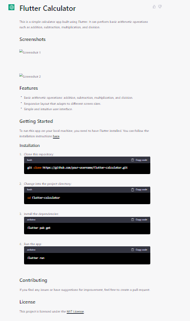

# Flutter Calculator

This is a simple calculator app built using Flutter and Dart. It can perform basic arithmetic operations such as addition, subtraction, multiplication, and division.

## Screenshots

 <!--width="195" height="420">  -->
<!-- &nbsp; &nbsp;  -->

## Features

- Basic arithmetic operations: addition, subtraction, multiplication, and division.
- Responsive layout that adapts to different scren sizes.
- Simple and intuitive user interface.
- Has light and dark mode.

### Dependencies
The project uses the following dependencies:

 - [math_expressions](https://pub.dev/packages/math_expressions)  - for mathematical calculations. 

## Getting Started

To run this app on your local machine, you need to have Flutter installed. You can follow the installation instructions [here.](https://flutter.dev/docs/get-started/install)

### Installation

1. Clone this repository:
   ```bash
   git clone https://github.com/GoldenOkey-Nwala/flutter-calculator.git
   ```
2. Change into the project directory:
   ```bash
   cd flutter-calculator
   ```
3. Install the dependencies:
   ```arduino
   flutter pub get
   ```
4. Run the app:
   ```arduino
   flutter run
   ```

## Contributing

If you find any issues or have suggestions for improvement, feel free to create a pull request.

## Reference

The UI design of the app was done by [Kenile Achije.](https://sites.google.com/view/kenileachije/home)

Download the app [here.]() Checkout my post on [LinkedIn.]() <!-- TODO Input the link to the linkedin post here. -->
